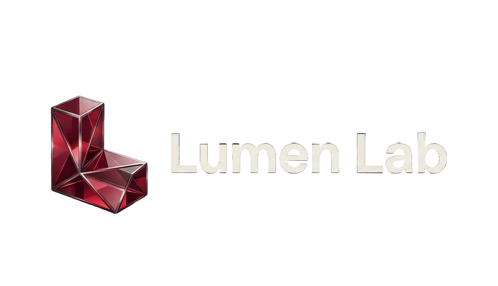

# Lumen Lab Video Grabber

A premium, high-performance desktop media acquisition engine built with **React**, **Python**, and **yt-dlp**.



## ✨ Features

-   **Premium Aesthetics**: A state-of-the-art interface featuring glassmorphism, floating layouts, and cinematic background animations.
-   **High-Fidelity Downloads**: Support for up to 4K (2160p) video and high-bitrate (320kbps) MP3 acquisition.
-   **Smart Persistence**: Automatically remembers your preferred download directory and maintains a persistent history across launches.
-   **Fluid UX**: 
    -   **One-Click Acquisition**: Paste and fetch metadata instantly.
    -   **Redownload**: Re-acquire any media from your history with a single click.
    -   **Reveal Folder**: Instantly highlight downloaded files in your system file explorer.
-   **Detached Navigation**: A modern, floating navigation bar for seamless switching between Download, History, and Settings.

## 🛠️ Tech Stack

-   **Frontend**: React, Vite, Tailwind CSS, shadcn/ui.
-   **Backend**: Python, PyWebView (for the desktop wrapper).
-   **Engine**: yt-dlp (industry-standard media extraction).

## 🚀 Getting Started

### Prerequisites
- Python 3.10+
- Node.js (for frontend development)
- FFmpeg (required for video/audio merging)

### Installation
1. Clone the repository:
   ```bash
   git clone https://github.com/Shaheer-Gujjar1/video-grabber.git
   cd video-grabber
   ```

2. Install Python dependencies:
   ```bash
   pip install -r requirements.txt
   ```

3. Build the frontend:
   ```bash
   npm install
   npm run build
   ```

### Running the App
Launch the desktop application using Python:
```bash
python3 app.py
```

## 📁 Project Structure
- `app.py`: The main entry point and PyWebView API.
- `src/`: React frontend source code.
- `public/`: Static assets and branding.
- `downloader.py`: Core logic for yt-dlp integration.
- `dist/`: Production build of the frontend.

---
Created and refined by **Shaheer Ahmed**.
